# Temporal CI/CD Workshop

A hands-on workshop demonstrating how Temporal revolutionizes CI/CD pipelines for platform engineering teams.

## Workshop Overview

This workshop progresses through 5 demonstrations, each building upon the previous one:

1. **Demo 1**: Basic Docker Pipeline - Sequential workflow with retry policies
2. **Demo 2**: Human Approval Integration - Kubernetes deployment with approval gates
3. **Demo 3**: Production Features - Deployment windows, timers, and rollbacks
4. **Demo 4**: Crash Resilience - Demonstrating Temporal's durability
5. **Demo 5**: Polyglot Finale - Multi-language worker coordination

## Prerequisites

- Docker Desktop with Kubernetes enabled
- Go 1.21+
- Python 3.8+ (for Demo 5)
- Node.js 18+ (for Demo 5)
- Temporal CLI (`brew install temporal`)
- kubectl configured for your cluster
- Access to a container registry (configured at workshop time)

## Quick Start

1. **Start Temporal Server**:
   ```bash
   temporal server start-dev
   ```

2. **Setup Kubernetes**:
   ```bash
   ./setup/setup-k8s.sh
   ```

3. **Navigate to Demo Branch**:
   ```bash
   # For Demo 1
   git checkout demo1-basic-pipeline
   
   # For Demo 2
   git checkout demo2-human-approval
   
   # And so on...
   ```

## Branch Structure

Each demo is contained in its own branch:

- `main` - Foundation and setup (you are here)
- `demo1-basic-pipeline` - Basic Docker workflow
- `demo2-human-approval` - Human-in-the-loop workflows
- `demo3-production-features` - Production-ready features
- `demo4-crash-resilience` - Tag pointing to demo1 for crash demo
- `demo5-polyglot-finale` - Multi-language coordination

## Workshop Resources

- **WORKSHOP_GUIDE.md** - Detailed instructions for workshop delivery
- **docs/** - Demo-specific guides in each branch
- **sample-app/** - Simple Go application used throughout demos

## CI/CD Pipeline Flow

```mermaid
flowchart LR
    A[Start Pipeline] --> B[Build Docker Image]
    B --> C[Test Container]
    C --> D[Push to Registry]
    
    D --> E{Environment?}
    E -->|staging| F[Deploy to Staging]
    E -->|production| F
    
    F --> G{Environment == production?}
    G -->|No| Z[Pipeline Complete]
    G -->|Yes| H[Send Approval Request]
    
    H --> I[Wait for Approval Signal]
    I --> J{Approved?}
    J -->|No| K[Pipeline Rejected]
    J -->|Yes| L[Deploy to Production]
    
    L --> M[Start 30s Validation Timer]
    M --> N{Validation Signal or Timer?}
    N -->|Validation Signal| O[Cancel Timer - Success]
    N -->|Timer Expires| P[Auto Rollback]
    
    O --> Z
    P --> Q[Rollback Complete]
    Q --> Z
    
    %% Styling
    classDef startEnd fill:#2563eb,stroke:#1e40af,stroke-width:2px,color:#ffffff
    classDef process fill:#7c3aed,stroke:#5b21b6,stroke-width:2px,color:#ffffff
    classDef decision fill:#ea580c,stroke:#c2410c,stroke-width:2px,color:#ffffff
    classDef success fill:#16a34a,stroke:#15803d,stroke-width:2px,color:#ffffff
    classDef failure fill:#dc2626,stroke:#b91c1c,stroke-width:2px,color:#ffffff
    
    class A,Z startEnd
    class B,C,D,F,H,L,M process
    class E,G,J,N decision
    class O success
    class K,P,Q failure
```



## Key Concepts Demonstrated

- **Reliability**: Workflows survive crashes and resume exactly where they left off
- **Human Integration**: Seamlessly blend automation with human approval gates
- **Observability**: Complete visibility into long-running processes
- **Polyglot**: Coordinate activities across multiple programming languages
- **Durability**: Timers and schedules that survive service restarts

## Getting Help

- Temporal Documentation: https://docs.temporal.io
- Workshop Issues: Create an issue in this repository
- Temporal Community: https://temporal.io/slack

## Clean Up

After the workshop, clean up resources:

```bash
./setup/cleanup.sh
```
